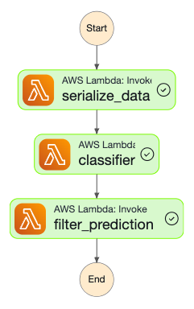

# Scones Unlimited — Image Classification Pipeline on AWS

An end-to-end, event-driven machine learning pipeline built on AWS that classifies delivery vehicle types (bicycle vs. motorcycle) to optimize routing for a scone-delivery logistics company. This project was completed as part of the **Udacity AWS Machine Learning Engineer Nanodegree**.

---

## Table of Contents

- [Project Overview](#project-overview)
- [Architecture](#architecture)
- [Project Steps](#project-steps)
- [Tech Stack](#tech-stack)
- [Repository Structure](#repository-structure)
- [Model Configuration](#model-configuration)
- [Lambda Functions](#lambda-functions)
- [Step Functions Workflow](#step-functions-workflow)
- [Results](#results)

---

## Project Overview

Image classifiers are used across many industries — from autonomous vehicles and augmented reality to e-commerce platforms and diagnostic medicine. In this project, I built a scalable, production-grade image classification pipeline for **Scones Unlimited**, a scone-delivery logistics company.

**Business Problem**: Scones Unlimited needs to automatically identify whether a delivery driver is using a bicycle or a motorcycle so they can be routed to the appropriate loading bay and assigned orders based on their range. Assigning cyclists to nearby orders and motorcyclists to farther destinations helps the company optimize its operations.

**ML Solution**: A binary image classifier trained on a subset of the CIFAR-100 dataset, deployed on Amazon SageMaker, and integrated into a fully automated, serverless inference pipeline using AWS Lambda and AWS Step Functions.

---

## Architecture

```
S3 (Image Store)
      │
      ▼
Lambda 1: Serialize Image Data
  (Download from S3, Base64-encode)
      │
      ▼
Lambda 2: Image Classifier
  (Invoke SageMaker Endpoint)
      │
      ▼
Lambda 3: Filter Low-Confidence Predictions
  (Threshold = 85%)
      │
      ▼
Result / Error State
```

The three Lambda functions are orchestrated by an **AWS Step Functions** state machine with automatic retry logic and exponential backoff on transient failures.



---

## Project Steps

### Step 1 — Data Staging (ETL)

- Downloaded the **CIFAR-100** dataset (hosted by the University of Toronto) and extracted it programmatically.
- Filtered the dataset to retain only the **bicycle** and **motorcycle** classes to frame the problem as binary classification.
- Transformed and saved images as 32×32 PNG files.
- Uploaded the processed training and test data to **Amazon S3**.

### Step 2 — Model Training and Deployment

- Used the **AWS built-in Image Classification algorithm** (ResNet-152 architecture) via the SageMaker SDK.
- Trained on an `ml.p3.2xlarge` GPU instance for 30 epochs.
- Deployed the trained model to a real-time inference endpoint on an `ml.m5.xlarge` instance.
- Configured **SageMaker Model Monitor** to capture inference data and track model performance over time.

### Step 3 — Lambda Functions and Step Functions Workflow

Wrote and deployed three AWS Lambda functions:

| # | Function Name | Responsibility |
|---|---|---|
| 1 | `serialize_image_data` | Downloads an image from S3 and returns it as a Base64-encoded payload |
| 2 | `classifier` | Decodes the image and invokes the SageMaker endpoint to get class probabilities |
| 3 | `filter_prediction` | Rejects inferences below the 85% confidence threshold; raises an error to halt the workflow |

Chained the Lambda functions into a sequential **Step Functions state machine** using the visual editor and exported the definition as an Amazon States Language (ASL) JSON file.

### Step 4 — Testing and Evaluation

- Invoked the Step Functions workflow multiple times using test dataset images.
- Verified that the pipeline succeeds on high-confidence predictions and fails (as expected) on low-confidence ones.
- Used inference data captured by **SageMaker Model Monitor** to build a visualization and monitor for model drift or degraded performance.

---

## Tech Stack

| Category | Technology |
|---|---|
| Cloud Platform | AWS |
| ML Training & Deployment | Amazon SageMaker |
| Serverless Compute | AWS Lambda (Python 3) |
| Workflow Orchestration | AWS Step Functions |
| Object Storage | Amazon S3 |
| Model Monitoring | SageMaker Model Monitor |
| ML Algorithm | AWS Built-in Image Classification (ResNet-152) |
| Dataset | CIFAR-100 (bicycle & motorcycle subsets) |
| Notebook Environment | SageMaker Studio (Python 3 Data Science kernel, `ml.t3.medium` instance) |

---

## Repository Structure

```
.
├── scones-unlimited.ipynb      # Main project notebook (ETL, training, deployment, evaluation)
├── Lambda.py                   # Source code for all three AWS Lambda functions
├── scones_unlimited.asl.json   # Step Functions state machine definition (ASL/JSONata)
├── stepfunctions_graph.png     # Screenshot of the working Step Functions workflow
└── README.md
```

---

## Model Configuration

| Hyperparameter | Value |
|---|---|
| Algorithm | Image Classification (ResNet-152) |
| Training Instance | `ml.p3.2xlarge` |
| Inference Instance | `ml.m5.xlarge` |
| Image Shape | 3 × 32 × 32 |
| Number of Classes | 2 (bicycle, motorcycle) |
| Training Samples | 1,000 |
| Epochs | 30 |
| Mini-Batch Size | 32 |
| Optimizer | SGD |
| Learning Rate | 0.1 |

---

## Lambda Functions

All three Lambda functions are defined in [`Lambda.py`](Lambda.py).

**Lambda 1 — `serialize_image_data`**
Downloads a target image from S3 using the bucket and key provided in the Step Functions input, encodes it as Base64, and returns the payload for the next state.

**Lambda 2 — `classifier`**
Decodes the Base64 image and invokes the deployed SageMaker endpoint (`image-classification-2025-09-19-11-44-58-428`) to obtain class probability scores.

**Lambda 3 — `filter_prediction`**
Parses the inference scores and checks whether the maximum confidence exceeds the **0.85 threshold**. If not, it raises an error that causes the Step Functions execution to fail, preventing low-confidence predictions from propagating downstream.

---

## Step Functions Workflow

The state machine is defined in [`scones_unlimited.asl.json`](scones_unlimited.asl.json) using **JSONata** as the query language. Each state retries up to 3 times with exponential backoff on the following Lambda errors:

- `Lambda.ServiceException`
- `Lambda.AWSLambdaException`
- `Lambda.SdkClientException`
- `Lambda.TooManyRequestsException`

**States**: `serialize_data` → `classifier` → `filter_prediction`

---

## Results

- Successfully trained and deployed a binary image classifier capable of distinguishing bicycles from motorcycles.
- Built a fully serverless, event-driven inference pipeline orchestrated by AWS Step Functions.
- Validated that the pipeline correctly handles both successful high-confidence inferences and graceful failures for low-confidence predictions.
- Integrated SageMaker Model Monitor to enable ongoing performance tracking and drift detection in production.
